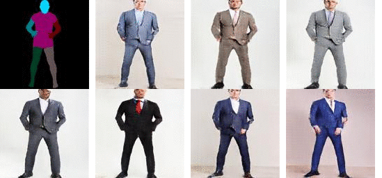

<br><br><br>

# UPG-GAN
This is the code base for our paper [**Unpaired Pose-Guided Human Image Generation**](todo: add link).We propose a new network architecture to generate human images from body part models, with unpaired training dataset.

Here you can find the necessary training and testing code, and the datasets and pre-trained models for **shirt and tshirt**(upper body)
 and **suit and dress** (full body).

## Prerequisites
- Linux or macOS
- Python 2 or 3
- NVIDIA GPU + CUDA CuDNN

## Getting Started
### Installation
- Install PyTorch and dependencies from http://pytorch.org
- Install Torch vision from the source.
```bash
git clone https://github.com/pytorch/vision
cd vision
python setup.py install
```
- Install python libraries [visdom](https://github.com/facebookresearch/visdom) and [dominate](https://github.com/Knio/dominate).
```bash
pip install visdom
pip install dominate
```
- Clone this repo:
```bash
git clone git@github.com:cx921003/UPG-GAN.git
cd UPG-GAN
```
### Data Preparation
- Download a dataset from our [Google Drive](https://goo.gl/KRQ9tM).
- Unzip the dataset under ``./datasets/`` folder.

### Pre-trained Models
- Download a pre-trained model from our [Google Drive](https://goo.gl/YwcWvv).
- Unzip the model under ``./checkpoints/`` folder.

### Testing:
- Configure the following arguments in ``./testing.sh``:
    - ``dataroot``: the path to the dataset
    - ``name``: the name of the model, make sure the model exists under ``./checkpoint/``
    - ``how_many``: number of input images to test
    - ``n_samples``: number of samples per input image
- Test the model: ``./testing.sh``
    
    
### Training
- Configure the following arguments in ``./training.sh``:
    - ``dataroot``: the path to the dataset
    - ``name``: the name of the model
- Train a model:``./training.sh``
- To view training results and loss plots, run `python -m visdom.server` and click the URL http://localhost:8097. To see more intermediate results, check out `./checkpoints/suit_and_dress/web/index.html`


The test results will be saved to a html file here: `./results/suit_and_dress/latest_test/index.html`.


## Citation
If you use this code for your research, please cite our papers.
```
to be added
```

## Acknowledgments
Code is heavily based on [pytorch-CycleGAN-and-pix2pix](https://github.com/junyanz/pytorch-CycleGAN-and-pix2pix.git) written by [Jun-Yan Zhu](https://github.com/junyanz) and [Taesung Park](https://github.com/taesung89).
